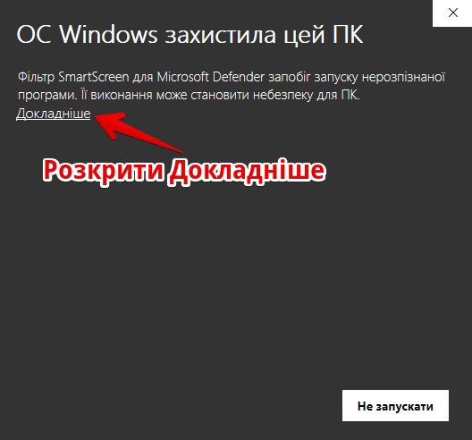
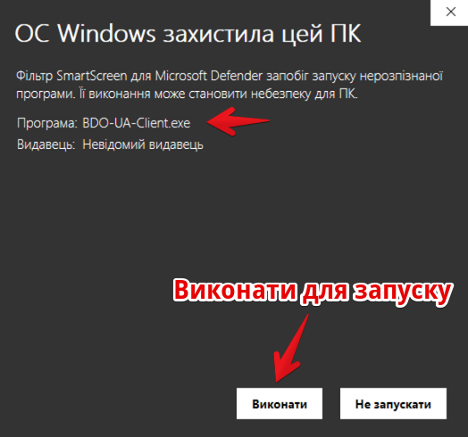
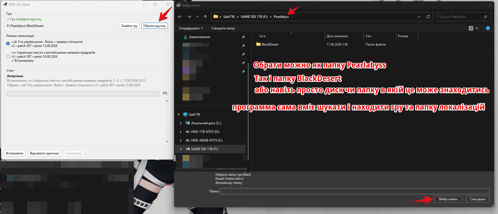
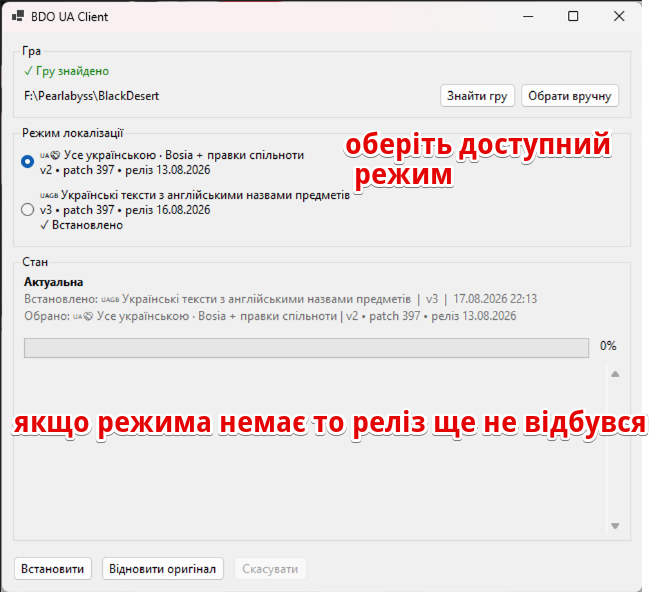
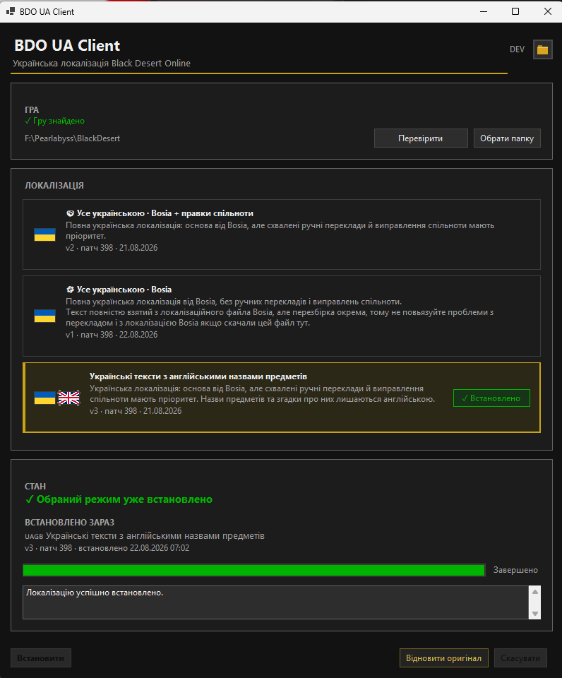
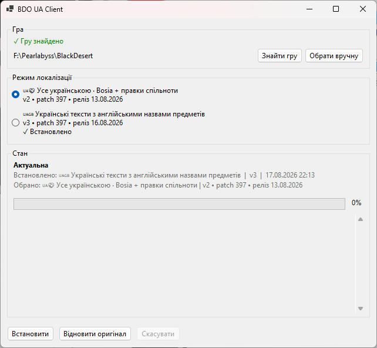

<p align="center">
  
</p>

<h1 align="center">BDO UA Client</h1>

<p align="center">
  Клієнт для встановлення української локалізації у Black Desert Online
</p>

<p align="center">
  <a href="https://github.com/merelyigor/bdo-ua-client/actions/workflows/ci.yml"></a>
</p>

---

## Про проект

**BDO UA Client** — це Windows-застосунок для встановлення та керування українською локалізацією [Black Desert Online](https://www.blackdesertonline.com/).

Застосунок працює разом з [проектом українізації BDO](https://bdo-ua.com.ua/) та отримує актуальні релізи локалізації через публічний API. Режими локалізації та їх версії визначаються сервером — клієнт не містить захардкоджених списків.

Проєкт є волонтерським та підтримується спільнотою.

### Можливості

- Автоматичний пошук встановленої гри
- Встановлення та оновлення локалізації з перевіркою SHA-256
- Кілька режимів локалізації на вибір
- Відновлення офіційного файлу гри
- Захист файлів гри: бекапи, атомарна заміна, rollback при помилках
- Детальні логи для діагностики

---

## Завантаження

Офіційні збірки BDO UA Client публікуються на сторінці **[GitHub Releases](https://github.com/merelyigor/bdo-ua-client/releases)**.

Завантажте архів:

```
BDO-UA-Client-vX.Y.Z-win-x64.zip
```

Розпакуйте — всередині один файл:

```
BDO-UA-Client.exe
```

Для роботи не потрібно встановлювати .NET Runtime — застосунок самодостатній (self-contained).

### Системні вимоги

- Windows 10/11 x64
- Підключення до інтернету
- Встановлена Black Desert Online

---

## Windows SmartScreen

BDO UA Client наразі не підписаний комерційним сертифікатом підпису коду (code-signing certificate). Тому Windows SmartScreen може показати попередження **"Невідомий видавець"** при першому запуску.

Наявність цього попередження сама по собі не означає, що файл є шкідливим. Windows може показувати SmartScreen для застосунків без впізнаваного цифрового підпису видавця або з недостатньою репутацією.

### Як запустити

1. Завантажте **BDO-UA-Client-vX.Y.Z-win-x64.zip** тільки з офіційної сторінки [GitHub Releases](https://github.com/merelyigor/bdo-ua-client/releases) репозиторію `merelyigor/bdo-ua-client`.
2. Розпакуйте архів.
3. Запустіть **BDO-UA-Client.exe**.
4. Якщо з'явилось вікно SmartScreen, натисніть **"Докладніше"**.



5. Перевірте, що вказано **BDO-UA-Client.exe**.
6. Натисніть **"Виконати"**.



> **Увага:** не натискайте "Виконати" для файлів, завантажених з невідомих сторонніх джерел. Використовуйте тільки офіційну сторінку релізів.

---

## Пошук гри

Після запуску застосунок автоматично шукає встановлену Black Desert Online. Якщо гра знайдена, відображається:

> ✓ Гру знайдено

Якщо гра не знайдена автоматично, натисніть **"Знайти гру"** або оберіть папку вручну кнопкою **"Обрати вручну"**.

### Ручний вибір папки



Поточна версія гарантовано підтримує вибір:

- самої папки гри (наприклад, `Black Desert Online`)
- її безпосередньої батьківської папки (наприклад, `Pearlabyss`)

Якщо в батьківській папці єдиний підкаталог з грою, клієнт знайде його автоматично.

---

## Вибір режиму локалізації



Клієнт отримує список доступних режимів з сервера. Режими можуть змінюватися — конкретний перелік залежить від поточних серверних даних.

- Оберіть один з доступних режимів
- Для кожного режиму показано назву, версію, номер патчу та дату релізу
- Встановлений реліз позначено: **✓ Встановлено**

У списку відображаються режими, для яких сервер наразі надає доступний реліз.

---

## Встановлення

1. Переконайтеся, що гру знайдено
2. Оберіть потрібний режим локалізації
3. Натисніть **"Встановити"**
4. Дочекайтеся завершення

Застосунок виконає:

- завантаження файлу з перевіркою SHA-256
- створення резервної копії поточного стану
- атомарну заміну файлу локалізації
- перевірку встановленого файлу

При успішному встановленні:

> Локалізацію успішно встановлено.



---

## Перемикання режимів



Якщо вже встановлено один режим локалізації, можна обрати інший та натиснути **"Встановити"**. Новий режим замінить поточний.

Окремої кнопки "Оновити" немає — оновлення відбувається через ту саму кнопку "Встановити", коли сервер надає новішу версію.

Якщо обраний реліз вже точно встановлено, кнопка "Встановити" неактивна.

---

## Відновлення оригінальної локалізації

Натисніть **"Відновити оригінал"** щоб повернути офіційний файл гри. Застосунок завантажить оригінальний файл з сервера або використає локальну копію.

---

## Стан

Блок стану показує поточну інформацію:

- **Стан локалізації** — фактичний стан встановленого файлу:
  - ✓ Встановлена локалізація актуальна
  - Доступна новіша версія встановленої локалізації
  - Локалізацію не встановлено
- **Встановлено** — що фізично встановлено зараз (режим, версія, дата)
- **Обрано** — що буде встановлено при натисканні "Встановити"

---

## Логи

Логи зберігаються у:

```
%LocalAppData%\BDO-UA-Client\logs\
```

Логи допомагають при діагностиці проблем. При зверненні з питаннями додайте вміст файлу логу за відповідний день.

---

## Питання та проблеми

1. Перевірте [логи](#логи) — там можуть бути деталі помилки
2. Переконайтеся, що гра знайдена правильно
3. Спробуйте перезапустити застосунок
4. Зверніться до спільноти BDO UA

---

## Пов'язані проєкти

| Проєкт | Опис |
|---|---|
| [bdo-ua.com.ua](https://bdo-ua.com.ua/) | Проєкт українізації Black Desert Online |
| [bdo-ua.com.ua/download](https://bdo-ua.com.ua/download) | Сторінка завантаження локалізації |

---

## Технічна документація

Для розробників: [docs/index.md](docs/index.md)

---

## Подяки

- [BDO UA](https://bdo-ua.com.ua/) — проєкт українізації Black Desert Online
- Перекладачі та спільнота за тестування та вдосконалення локалізації
- Bosia — за створення основи українського перекладу
